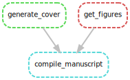
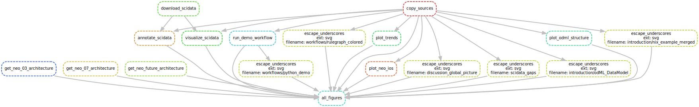

# Dissertation Workflow

This repository contains all material required for the generation of the dissertation `Tools and Workflows for Data & Metadata Management of Complex Experiments Building a Foundation for Reproducible & Collaborative Analysis in the Neurosciences` by Julia Sprenger.

The manuscript is generated using a snakemake workflow and consists of a main part compiling the pdf document using latex and a subworkflow that generates, compiles and structures all figures and code examples used in the manuscript.

## Main Workflow

## Figure Generating Workflow

## Execution
For convienience usage both workflows run using the [`run_all.sh`](run_all.sh) and [`material/run_all.sh`](material/run_all.sh) scripts, respectively.
The underlying folder structure of the workflow can be configured using the `config.yml` provided with the workflow.

## License
© 2019. This work is licensed under a [CC BY 4.0 license](https://creativecommons.org/licenses/by/4.0/). 
